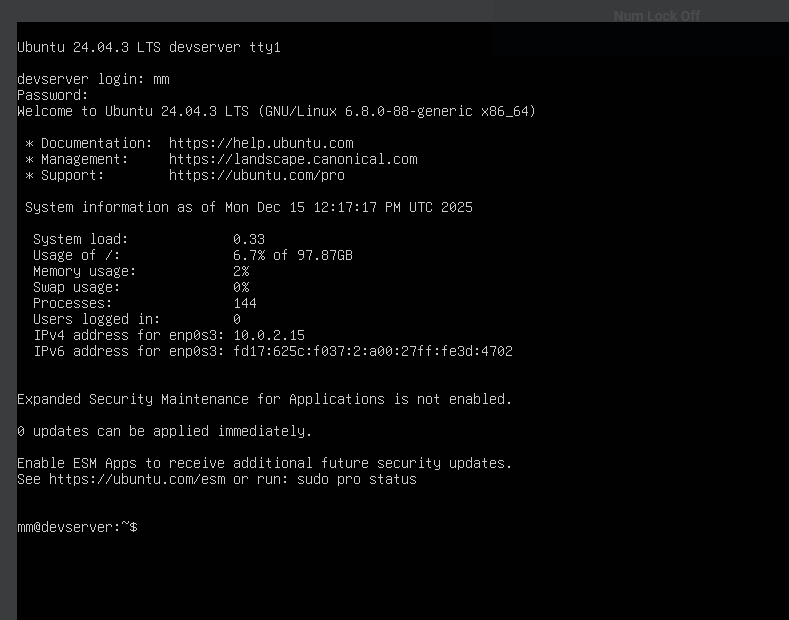
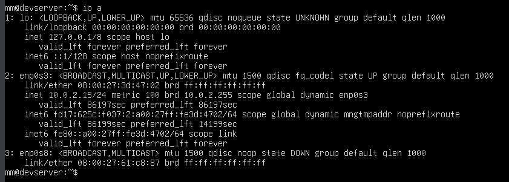

# SSH Into a VirtualBox Ubuntu 24.04.3 VM on Windows Host

This guide will walk you through setting up SSH access to your Ubuntu VM running in VirtualBox on a Windows host machine.

## Prerequisites

At this point, your VM should have been installed and be able to connect to the internet. SSH should be installed and running on your Ubuntu VM.

---

## Step 1: Verify SSH Installation and Status

First, check if the SSH service is active and running on your Ubuntu VM.
```bash
sudo systemctl status ssh
```

**What this does:** This command checks the current status of the SSH service (OpenSSH server). If SSH is properly installed and running, you'll see an "active (running)" status.

### If SSH is Not Installed

If you see an error message saying **"Unit ssh.service could not be found"**, you need to install the OpenSSH server:
```bash
sudo apt update
sudo apt install openssh-server -y
```

**Explanation:**
- `sudo apt update` - Updates your package lists to ensure you're installing the latest version
- `sudo apt install openssh-server -y` - Installs the OpenSSH server package. The `-y` flag automatically answers "yes" to installation prompts

### Start and Enable SSH Service

After installation, enable SSH to start automatically on boot and start the service immediately:
```bash
sudo systemctl enable ssh
sudo systemctl start ssh
```

**Explanation:**
- `enable` - Configures SSH to start automatically when the system boots
- `start` - Starts the SSH service immediately without requiring a reboot

### Verify SSH is Running

Re-check the SSH status to confirm it's working:
```bash
sudo systemctl status ssh
```

At this point, the SSH service should be running and the output will look similar to this:


Once confirmed, **shutdown your VM** and proceed to configure VirtualBox network settings.

---

## Step 2: VirtualBox Network Settings

To enable SSH access from your Windows host to the Ubuntu VM, you need to configure two network adapters in VirtualBox.

### Configure Adapter 1 (NAT)

Keep your **Adapter 1** set as **"NAT"**. This adapter provides your VM with internet access through your host machine's network connection.


**Why NAT?** Network Address Translation (NAT) allows your VM to access the internet while hiding behind your host's IP address. It's the default and most straightforward way to give your VM internet connectivity.

### Configure Adapter 2 (Host-only Adapter)

Enable **Adapter 2** and configure it as follows:
- **Attached to:** Host-only Adapter
- **Promiscuous Mode:** Allow All


**What this does:** 
- **Host-only Adapter** creates a private network between your Windows host and the VM. This network is isolated from your main LAN but allows direct communication between host and VM.
- **Promiscuous Mode: Allow All** permits the network adapter to receive all network traffic, not just traffic addressed to it. This ensures proper communication in the host-only network.

After configuring both adapters, **start your VM**.



---

## Step 3: Ubuntu Network Interfaces

Once your VM is running, you need to identify the network interfaces and their IP addresses.

### Check Network Interfaces

Run the following command to display all network interfaces and their configuration:
```bash
ip a
```

**What this command does:** The `ip a` (or `ip address`) command shows all network interfaces, their status, IP addresses, and other network configuration details.

### Example Output



### Understanding the Network Interfaces

You should see three main interfaces:

#### 1. `lo` - Loopback Interface
The loopback interface allows the Ubuntu VM to communicate with itself using the special IP address `127.0.0.1` (also known as `localhost`) and typically `::1` for IPv6.

**Purpose:** Used for internal communication within the VM itself. Essential for many applications and services.

#### 2. `enp0s3` - NAT Interface
This interface corresponds to **Adapter 1 (NAT)** in VirtualBox. It provides the VM with outbound internet access via VirtualBox's NAT.

**Important:** The VM is not directly reachable from your LAN through this interface by default. It's primarily for the VM to access external networks.

#### 3. `enp0s8` - Host-only Interface
This interface corresponds to **Adapter 2 (Host-only Adapter)** in VirtualBox. It provides a private network between the Windows host and the Ubuntu VM (and other VMs on the same host-only network).

**DHCP:** If the VirtualBox Host-only DHCP server is enabled, this interface will typically obtain an IP address automatically via DHCP. However, we'll configure a static IP for consistent SSH access.

---

## Step 4: Configure Netplan for Static IP

Ubuntu uses Netplan for network configuration. We'll edit the Netplan configuration file to assign a static IP address to the host-only adapter.

### Understanding Netplan

**Netplan** is Ubuntu's network configuration utility that uses YAML files to define network settings. The configuration file we'll edit is located at `/etc/netplan/50-cloud-init.yaml`.

### Backup the Original Configuration

As a best practice, always create a backup of configuration files before editing them. This allows you to restore the original settings if something goes wrong.
```bash
sudo cp /etc/netplan/50-cloud-init.yaml /etc/netplan/50-cloud-init.yaml.backup
```

**Note:** The `.backup` extension is not a system requirement. You can use any naming convention you prefer (e.g., `.bak`, `.old`). To restore the original settings, simply rename the backup file back to `50-cloud-init.yaml`.

### Edit the Configuration File

Open the original configuration file with a text editor (we'll use nano):
```bash
sudo nano /etc/netplan/50-cloud-init.yaml
```

**Nano basics:**
- Use arrow keys to navigate
- `Ctrl + O` to save (write out)
- `Ctrl + X` to exit

### Apply the Following Configuration

Replace the contents of the file with this configuration:
```yaml
network:
  version: 2
  ethernets:
    enp0s3:
      dhcp4: true
      dhcp6: false
    enp0s8:
      dhcp4: false
      dhcp6: false
      addresses: [192.168.56.10/24]
      nameservers:
        addresses: [8.8.8.8, 1.1.1.1]
      optional: true
```

**Configuration explained:**

- **`enp0s3` (NAT Interface):**
  - `dhcp4: true` - Automatically obtains IPv4 address via DHCP (for internet access)
  - `dhcp6: false` - Disables IPv6 DHCP

- **`enp0s8` (Host-only Interface):**
  - `dhcp4: false` - Disables DHCP to use static IP instead
  - `dhcp6: false` - Disables IPv6 DHCP
  - `addresses: [192.168.56.10/24]` - Assigns static IP address `192.168.56.10` with subnet mask `255.255.255.0` (the `/24` notation)
  - `nameservers` - Configures DNS servers (Google's 8.8.8.8 and Cloudflare's 1.1.1.1)
  - `optional: true` - Allows the system to boot even if this interface fails to configure

**Important:** YAML files are sensitive to indentation. Use spaces (not tabs) and ensure the indentation matches exactly as shown above.

### Apply the Network Configuration

After saving the file, generate and apply the new network configuration:
```bash
sudo netplan generate
sudo netplan apply
```

**What these commands do:**
- `netplan generate` - Validates your YAML syntax and generates the backend configuration files
- `netplan apply` - Applies the new network settings without requiring a reboot

If you encounter errors, double-check your YAML syntax, especially indentation and spacing.

---

## Step 5: SSH Into the VM from Windows

Now that your VM has a static IP address on the host-only network, you can SSH into it from your Windows host machine.

### SSH Command Syntax
```bash
ssh username@ipaddress
```

**Replace:**
- `username` - Your Ubuntu VM username
- `ipaddress` - The static IP you configured (192.168.56.10)

### Example SSH Connection
```bash
ssh mm@192.168.56.10
```

**What happens:**
1. SSH client on Windows connects to the Ubuntu VM at the specified IP address.
2. You'll be prompted to accept the host key fingerprint (first time only).
3. Enter your Ubuntu user password when prompted.
4. You'll be logged into your Ubuntu VM's terminal.

### First-Time Connection

The first time you connect, you'll see a message about the host's authenticity:
```
The authenticity of host '192.168.56.10 (192.168.56.10)' can't be established.
ECDSA key fingerprint is SHA256:...
Are you sure you want to continue connecting (yes/no)?
```

Type `yes` and press Enter to continue.

### Windows SSH Client

**Windows 10/11:** OpenSSH client is pre-installed. Use Command Prompt, PowerShell, or VS Code.

**Older Windows versions:** Install [PuTTY](https://www.putty.org/) or enable OpenSSH client through Windows Features.

---

## Troubleshooting

### Cannot Connect via SSH

1. **Verify SSH service is running on VM:**
```bash
   sudo systemctl status ssh
```

2. **Check firewall settings:**
```bash
   sudo ufw status
   sudo ufw allow ssh
```

3. **Verify static IP was applied:**
```bash
   ip a
```
   Look for `192.168.56.10` on the `enp0s8` interface.

4. **Ping the VM from Windows:**
```cmd
   ping 192.168.56.10
```

### Connection Refused

- Ensure SSH service is running: `sudo systemctl start ssh`
- Check if firewall is blocking port 22: `sudo ufw allow 22/tcp`

### Network Configuration Errors

If `netplan apply` fails:
1. Check YAML syntax (indentation must be spaces, not tabs)
2. Restore backup: `sudo cp /etc/netplan/50-cloud-init.yaml.backup /etc/netplan/50-cloud-init.yaml`
3. Apply backup configuration: `sudo netplan apply`

---

## Summary

You have successfully:
1. Installed and configured OpenSSH server on Ubuntu VM.
2. Configured VirtualBox with NAT and Host-only adapters.
3. Assigned a static IP address to the host-only interface.
4. Established SSH connection from Windows host to Ubuntu VM.

You can now access your Ubuntu VM's command line directly from your Windows host machine using SSH!